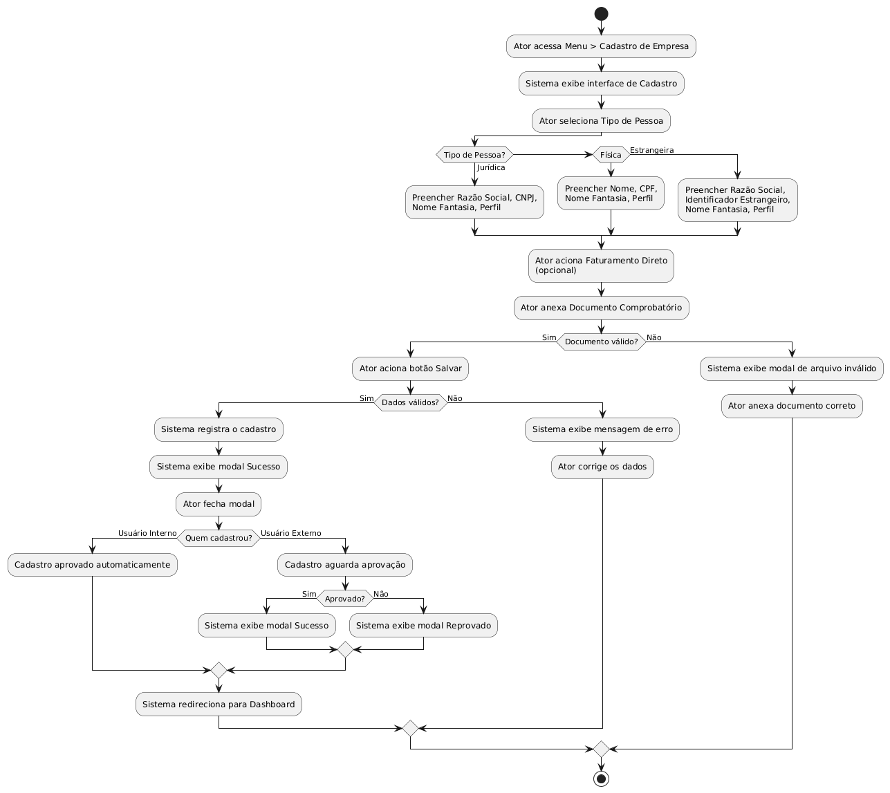
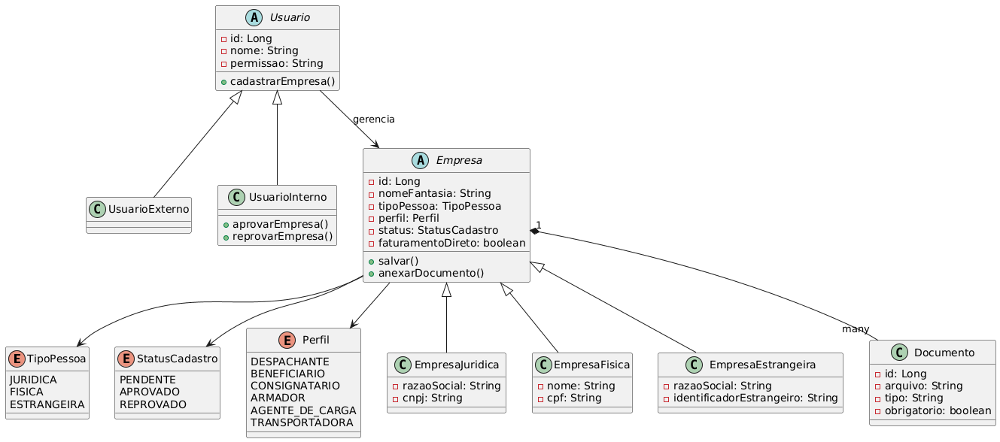

## Portal de serviço ST [Cadastro de Empresa] (Backend)

Os diagramas de caso de uso, classe e atividade, estão na pasta diagramas.
Os diagramas foram desenvolvidos através do site https://www.plantuml.com.
## Diagramas

## API REST desenvolvida em Java com SpringBoot para o Portal ST de Cadastro de Empresas.

Tecnologias que foram utilizadas
* Java 21
* Spring Boot 4.0.3
* Spring Data JPA
* PostgreSQL 
* Lombok
* Maven

O Banco de dados utilizado foi o PostgreSQL.
As informações utilizadas para criação do BD
* Database: cadastrodb
* Username: cadastrouser
* Password: 1234
- As informações de conexão do BD estão em src/main/resources/application.properties.

Para rodar a aplicação
`./mvnw spring-boot:run`

## Endpoints
*  `/api/empresas` - Cadastrar empresa
*  `/api/empresas/{id}/aprovar` - Aprovar empresa
*  `/api/empresas/{id}/reprovar` - Reprovar empresa
*  `/api/empresas` - Listar empresas
*  `/api/empresas/pendentes` - Listar empresas pendentes
*  `/api/documentos/{empresaId}` - Upload de documento

Swagger foi utilizado para documentação das APIs.
http://localhost:8080/swagger-ui/index.html

---
## Estrutura do Projeto

Em `EmpresaController` se encontram os endpoints de cadastrar, aprovar, reprovar e listar empresas,
tanto o listamento de todas quanto apenas as pendentes. Em `DocumentoController` está o endpoint
de upload do documento, aceitando apenas formatos válidos (pdf, png, jpg e jpeg).
Os documentos enviados estão sendo armazenados na pasta `uploads/` na raiz do projeto.

Em `model` há os enums para melhor organização. 
* `Perfil` (tipos de perfil da empresa),
* `StatusCadastro` (PENDENTE, APROVADO, REPROVADO) e`TipoPessoa` (JURIDICA, FISICA, ESTRANGEIRA).
* A classe `Empresa` está abrangindo todos esses enums.

`EmpresaRepository` é a camada onde está encapsulada a lógica de interação com o banco de dados.

Em `EmpresaService` estão as regras de negócio [RN01] e [RN02]. Cadastros realizados
por usuário interno são aprovados automaticamente, enquanto cadastros por usuário externo
aguardam aprovação com status PENDENTE.

